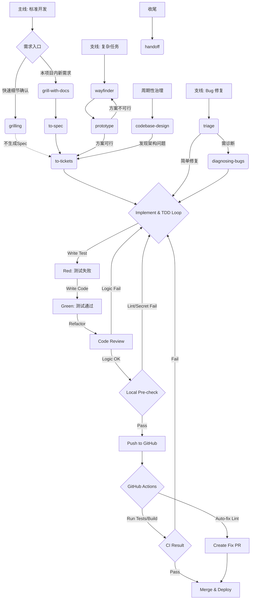

## AI 协作强制工作流 (Matt Pocock Engineering Loop)

本项目的核心工程纪律是：**状态化拷问、垂直切片交付、证据链闭环**。AI 必须严格按以下流程图执行：

### 关键执行要求
1. **统一入口 (`grill-with-docs`)**：在本项目目录下发起任何新需求时，**必须**使用 `grill-with-docs`。**严禁使用 `grill-me`**，因为它无法沉淀项目知识到 `CONTEXT.md`。
2. **上下文卫生 (Context Hygiene)**：
   - `grill-with-docs` → `to-spec` → `to-tickets` 必须在**同一个连续上下文窗口**内完成。
   - 每个 Ticket 的实现（`implement`）必须开启**新的会话窗口**或使用 `/clear` 清空上下文，防止 Token 耗尽导致推理能力下降。
3. **原型优先**：如果需求涉及复杂的 UI 交互或状态模型，必须先通过 `handoff` 跳转到 `prototype` 进行验证，验证通过后再回到主线。
4. **双重验证策略**：
   - **首选**：调用 `playwright-cli` 验证 DB→UI 全通。
   - **降级**：若因环境原因（如认证阻塞）导致 E2E 失败，**必须**提供手动测试截图/录屏，并在 Commit 中标注 `[Manual Verified]`。
5. **双轴审查 (`code-review`)**：并行运行 Standards（规范）和 Spec（规格）审查，确保代码既符合架构又忠实于需求。

## 交付前自检清单 (Pre-Delivery Checklist)

1. **规格一致性**：`code-review` 确认代码与 Spec 100% 对齐。
2. **TDD 覆盖**：所有核心逻辑均有 RED-GREEN-REFACTOR 记录。
3. **垂直切片验证**：已通过 `playwright-cli` 或**手动存证**证明该 Ticket 已实现 DB→UI 全通。
4. **安全合规**：无高危安全风险，符合制药行业 GMP 数据完整性要求。
5. **本地预检通过**：已通过 `ruff check`、`tsc --noEmit` 及敏感信息扫描。

**只有当以上 5 项全部通过后，才允许执行 `git push`。**

## 🛑 开发纪律红线 (Engineering Discipline)

### 1. 技能强制调用
- **禁止黑盒开发**：在进入 `E (implement)` 阶段前，必须明确声明将调用的技能（如 `/tdd`, `/security-best-practices`）。
- **即时验证**：每完成一个小功能点（如一个 API 接口或一个 UI 组件），必须立即调用 `/tdd` 或运行 `tsc/ruff` 进行局部验证。

### 2. 证据链闭环
- **后端**：必须提供 `pytest` 通过的截图或日志。
- **前端**：必须提供 `tsc --noEmit` 无错误的证明。
- **E2E 降级**：如果自动化测试不可用，**必须**提供手动测试的截图/录屏，并在 Commit Message 中标注 `[Manual Verified]`。

### 3. 本地预检门禁 (Local Pre-check)
- **背景**：由于 `pr-review-ci-fix` 技能当前不可用，开发者必须在本地手动执行等效检查。
- **强制动作**：
  1. 运行 `ruff check .` 确保 Python 代码无语法和规范错误。
  2. 运行 `npx tsc --noEmit` 确保前端类型安全。
  3. **敏感信息扫描**：手动检查 `.env` 或硬编码字符串，确保没有密钥泄露。
- **推送禁令**：在 `Local Pre-check` 失败的情况下，**严禁**执行 `git push`。
