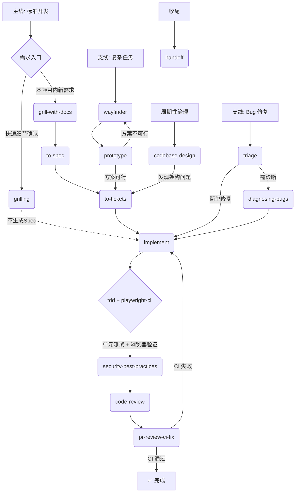

# AI 编程规范 (Livzon-Syntpharm)

本文档定义 AI 编码助手必须遵守的规则。违反这些规则会导致代码被拒绝。

## 目录
- [仓库通用规则](#仓库通用规则)
- [仓库组织](#仓库组织)
- [后端 — Python / FastAPI](#后端----python--fastapi)
- [前端 — Next.js / TypeScript](#前端----nextjs--typescript)
- [AI 协作强制工作流](#ai-协作强制工作流-matt-pocock-engineering-loop)

---

## 仓库通用规则

- **禁止硬编码**：禁止硬编码绝对文件路径（使用配置、环境变量或相对路径）。
- **禁止本地地址**：禁止在 URL 中硬编码 `localhost` / `127.0.0.1`（使用环境变量）。
- **敏感信息保护**：禁止在日志或异常中输出 API key、token、密码等敏感信息；禁止提交 `.env` 文件。
- **契约优先**：前后端之间的交叉引用必须通过公共契约（OpenAPI spec），禁止手写 API 类型。

## 仓库组织

### 测试与脚本
- **测试位置**：单元测试在 `backend/tests/unit/`，集成测试在 `backend/tests/integration/`，Fixture 在 `backend/tests/fixtures/`。
- **脚本分类**：
  - `scripts/ci/`: CI 编排、迁移检查。
  - `scripts/sync/`: **飞书同步**与多维表格检查。
  - `scripts/migration/`: 一次性数据迁移与回填。
- **跨项目 CI**：根目录 `scripts/ci.sh` 负责 OpenAPI 导出与 E2E 测试。

### 第三方代码与文档
- **Vendor 管理**：第三方库放在 `backend/vendor/`，禁止将外部仓库直接克隆到 `backend/` 根目录。
- **文档规范**：后端文档放在 `backend/docs/`，禁止将 `.docx`、`.xlsx` 或 PDF 文件放在 `backend/` 根目录。

---

# 后端 — Python / FastAPI

## 架构原则
本项目采用**模块化单体架构**。**禁止**引入微服务、消息队列或其他复杂架构。
**技术栈**：Python 3.12+、FastAPI、SQLAlchemy 2.0 async、PostgreSQL 17、Redis、Alembic、Pydantic v2、uv、MinIO。

## 目录结构与模块所有权
```
backend/app/
├── core/              # 基础设施：配置、数据库、Redis、异常、响应
├── shared/            # 跨模块契约：ORM 基类、模块注册表
├── platform/          # 平台能力：审计、身份、用户档案、外部集成
├── modules/           # 业务模块（每个模块独立维护 API、Schema、Service、Repository、Model）
└── api/router.py      # 全局路由装配
```
- **禁止**：在 `app/models/`、`app/schemas/` 等已废弃的横向目录中放置新业务代码。
- **跨模块协作**：只能通过目标模块的 `public_api.py` 调用。**禁止**直接 import 其他模块的内部实现。
- **新建模块**：未经用户明确指示，禁止创建新业务模块。新功能必须放入已有模块。

## API 规范与认证
- **路由形式**：所有路由挂载在 `/api/v1/{module}/{resource}`。
- **依赖注入**：新增业务接口必须显式选择 `RequiredUser`（默认，需登录）或 `OptionalUser`。
- **飞书 Webhook**：**禁止**使用 `RequiredUser`。必须复用 `app/platform/identity/service.py` 中的 `_verify_feishu_callback_signature()` 进行 Token 和签名验证。

## 数据库规范
- **Schema 隔离**：使用 PostgreSQL schema 做模块隔离（如 `identity`, `audit`, `quality`）。
- **ORM 规则**：业务模型必须继承 `app/shared/base_model.py` 中的 `BaseModel`，并显式声明 `__table_args__ = {"schema": "<module_schema>"}`。
- **迁移管理**：所有数据库变更必须通过 Alembic 迁移管理，**禁止**使用 `create_all()`。

## Docker 构建与开发环境
- **开发模式**：必须使用 `docker compose -f docker-compose.yml -f docker-compose.dev.yml up -d --build`。
- **生产构建**：使用 `next build` 生成 standalone 模式，无热更新。

---

# 前端 — Next.js / TypeScript

## 架构原则
**技术栈**：Next.js 14+ (App Router)、TypeScript、Tailwind CSS、Zustand、Playwright。

## 代理层规范 (`src/proxy.ts`)
- **职责**：仅负责 API 转发、流式响应处理和轻量登录状态判断。
- **禁止**：在 `proxy.ts` 中进行角色权限判断、业务规则处理、数据库访问或 LLM 调用。真实授权必须由 FastAPI 后端执行。

## 类型系统
- **唯一来源**：所有 API 类型必须从 `@/types/generated/schema` 导入。
- **同步流程**：后端改动后，必须运行 `bash scripts/ci.sh openapi` 重新生成前端类型。

---


## AI 协作强制工作流 (Matt Pocock Engineering Loop)

本项目的核心工程纪律是：**状态化拷问、垂直切片交付、证据链闭环**。AI 必须严格按以下流程图执行：



### 关键执行要求
1.  **统一入口 (`grill-with-docs`)**：在本项目目录下发起任何新需求时，**必须**使用 `grill-with-docs`。**严禁使用 `grill-me`**，因为它无法沉淀项目知识到 `CONTEXT.md`。
2.  **上下文卫生 (Context Hygiene)**：
    *   `grill-with-docs` → `to-spec` → `to-tickets` 必须在**同一个连续上下文窗口**内完成。
    *   每个 Ticket 的实现（`implement`）必须开启**新的会话窗口**或使用 `/clear` 清空上下文，防止 Token 耗尽导致推理能力下降。
3.  **原型优先**：如果需求涉及复杂的 UI 交互或状态模型，必须先通过 `handoff` 跳转到 `prototype` 进行验证，验证通过后再回到主线。
4.  **双重验证**：`implement` 内部驱动 `tdd` 循环，完成后必须调用 `playwright-cli` 验证 DB→UI 全通。
5.  **双轴审查 (`code-review`)**：并行运行 Standards（规范）和 Spec（规格）审查，确保代码既符合架构又忠实于需求。

## 交付前自检清单 (Pre-Delivery Checklist)

1. **规格一致性**：`code-review` 确认代码与 Spec 100% 对齐。
2. **TDD 覆盖**：所有核心逻辑均有 RED-GREEN-REFACTOR 记录。
3. **垂直切片验证**：`playwright-cli` 证明该 Ticket 已实现 DB→UI 全通。
4. **安全合规**：无高危安全风险，符合制药行业 GMP 数据完整性要求。
5. **CI 全绿**：`pr-review-ci-fix` 确认构建与测试全部通过。

**只有当以上 5 项全部通过后，才允许执行 `git push`。**
